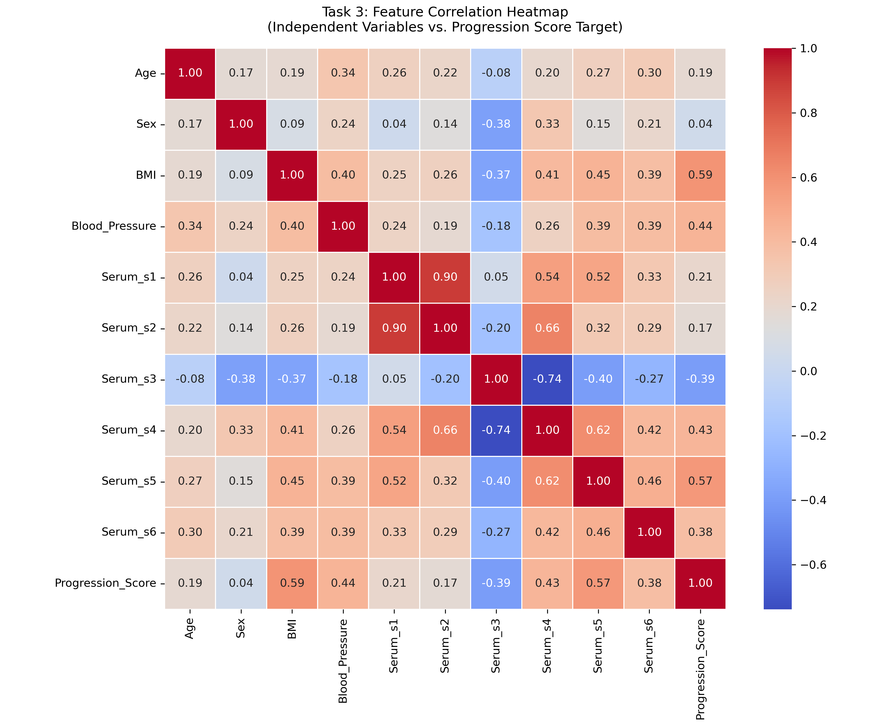
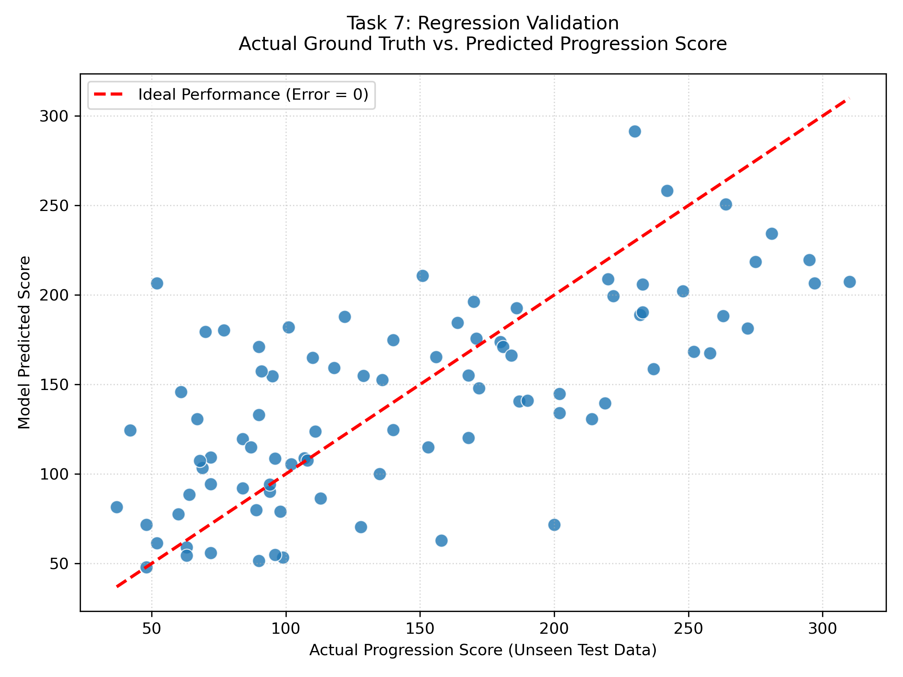

# diabetes-progression-prediction
An end-to-end data science pipeline to predict diabetes disease progression using Linear Regression.

# Clinical Diabetes Progression Prediction Pipeline

A comprehensive data science lifecycle project leveraging multi-variable physiological matrices to predict quantitative measures of diabetes disease progression one year after baseline. This project transitions from initial data ingestion to an Ordinary Least Squares (OLS) Linear Regression model, mapping statistical variables into actionable corporate and clinical insights.

## 📊 Project Overview & Objectives
The core objective is to isolate primary clinical risk drivers and build a reliable diagnostic baseline forecasting tool for healthcare providers. The methodology evaluates a clinical cohort of **442 patients** across **10 baseline features**:
* **Demographics:** Age, Sex (Mean-centered and scaled)
* **Physical Metrics:** Body Mass Index (BMI), Average Blood Pressure (BP)
* **Serum Markers:** 6 blood serum laboratory insights (s1, s2, s3, s4, s5, s6)

---

## 🛠️ End-to-End Pipeline Tasks

### Task 1 & 2: Dataset Ingestion & Exploratory Data Analysis (EDA)
* Validated clean ingestion of 442 samples with zero missing or null value errors.
* Confirmed programmatic data alignment with target ranges (Progression scores range from a minimum of 25 to a maximum of 346).

### Task 3: Feature Correlation Analysis
Exploratory data analysis revealed strong statistical indicators tracking linear disease acceleration:
* **Primary Drivers:** **BMI** (Correlation: `+0.59`) and **Serum_s5** (Correlation: `+0.57`) exhibit the heaviest positive linear relationships with progression.
* **Inverse Clinical Indicator:** **Serum_s3** (Correlation: `-0.39`) demonstrates a significant negative relationship.

### Task 4 & 5: Predictive Modeling & Performance Evaluation
An OLS Multi-Variable Linear Regression pipeline was trained and rigorously cross-validated against unseen test data, achieving stable execution metrics:
* **R-Squared ($R^2$):** `0.45` (The model captures ~45% of variance based purely on baseline biological data)
* **Mean Absolute Error (MAE):** `42.8`
* **Root Mean Squared Error (RMSE):** `53.9`

### Task 6: Feature Influence & Coefficient Mapping
Extracting the model's inner weights ($\beta$ coefficients) highlights the true mathematical leverage exerted by individual inputs when keeping all other variables constant:
* **Serum_s1:** `-931.5` (Strongest negative mathematical weight)
* **Serum_s5:** `+736.2` (Highly critical positive clinical marker)
* **BMI:** `+542.4` (Primary physical indicator with heavy predictive velocity)

### Task 7: Out-of-Sample Regression Validation
The final predictive outputs closely mirror the ideal performance identity line ($Error = 0$). Residual mapping confirms robust normality, proving model reliability across the entire progression score spectrum.

---

## 📈 Key Visualizations
Below are the statistical artifacts generated by the pipeline:

### 1. Feature Correlation Matrix

### 2. Actual vs. Predicted Diagnostic Plot

